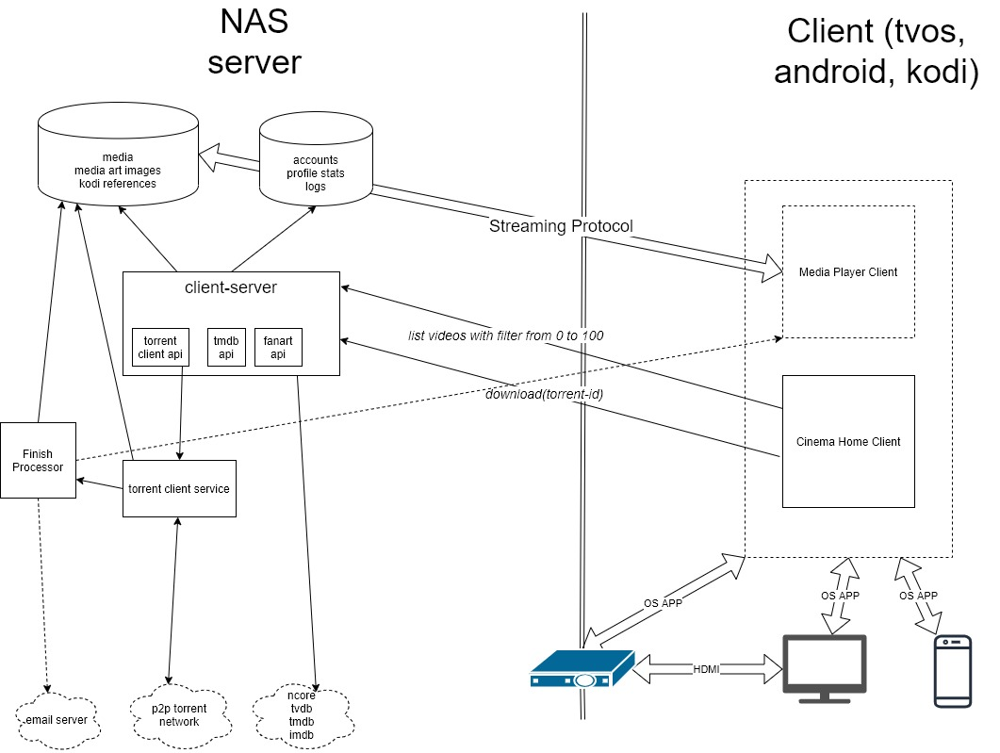

<h1 align="center">
  Cinema Home - In-House Movie Streaming Environment
</h1>

<p align="center">
  <a href="LICENSE.md"></a>
  <a></a>
  <a href="https://github.com/captainzs/cinema-home-server/pulls"></a>
  <a href="https://github.com/captainzs/cinema-home-server/actions"></a>
</p>

## Contents:
1. [ Overview ](#overview)
2. [ Install Server ](#install)
    1. [ Configuration ](#config)
    2. [ Download ](#download)
    3. [ Run with Docker ](#docker)
    4. [ Run with Maven and Java ](#mvn)
    5. [ Verify installation ](#verify)
3. [ Install Client(s) ](#clients)
4. [ Architecture ](#arch)

<a name="overview"></a>
## 1. Overview
 Cinema-Home is a software system that lets you enjoy movies and tv-shows for free. With seemlessly integrating to third-party media softwares (TMDB, IMDB, Fanart.tv) Cinema-Home works just like your favorite paid streaming service, like Netflix or HBO. Movies and tv-shows are downloaded through torrent-trackers with no user interactions at all.
 
<a name="install"></a>
## 2. Install Server
<a name="config"></a>
### 2.1. Configuration
You will need to register API keys and acoounts to different third-party systems to get the most out of this software. Add these keys to your OS environment variables:
- **NCORE_USERNAME**, **NCORE_PASSWORD**: You can register an account on https://ncore.cc/
- **TMDB_API_KEY**: Get and API key for the TMDB service to get the as much information about the movies as you can: https://www.themoviedb.org/documentation/api
- **FANART_API_KEY**: Get an API key for the Fanart service to make your experience more visual: https://fanart.tv/get-an-api-key/
<a name="download"></a>
### 2.2. Download
Currently there are no public artifactories and installation packages for this application so you have to clone this repository:
```
git clone https://github.com/captainzs/cinema-home-server.git
```
<a name="docker"></a>
### 2.3. Run with Docker
If you have *docker* and *docker-compose* binaries installed to your system than you can run the server with a single command:
```
docker-compose -f cinema-home-server.docker-compose.yml up --build
```
<a name="mvn"></a>
### 2.4. Run with Maven and Java
If you do not have docker you can also build and run the code itself
```
mvn clean package --file cinema-home-client-server/pom.xml
java -jar cinema-home-client-server/cinema-home-client-server-assembly-ncore-transmission/target/cinema-home-client-server-assembly-ncore-transmission-0.1-SNAPSHOT.jar
```
<a name="verify"></a>
### 2.5. Verify installation
You can check if you done everything right by opening http://localhost:8080/swagger-ui.html webpage.
<a name="clients"></a>
## 3. Install Client(s)
You can find details about available client softwares [in my repository](https://github.com/captainzs).

<a name="arch"></a>
## 4. Architecture


### License
Cinema-Home is [GPLv3 licensed](https://github.com/captainzs/cinema-home-server/blob/main/LICENSE). You may use, distribute and copy it under the license terms.
